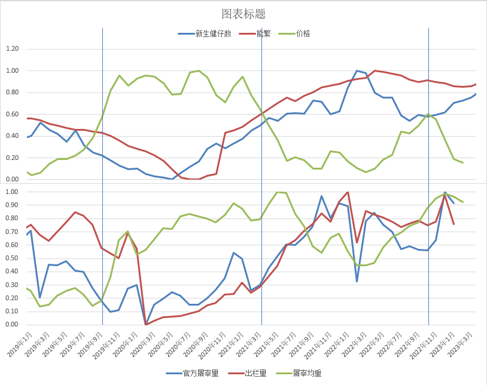
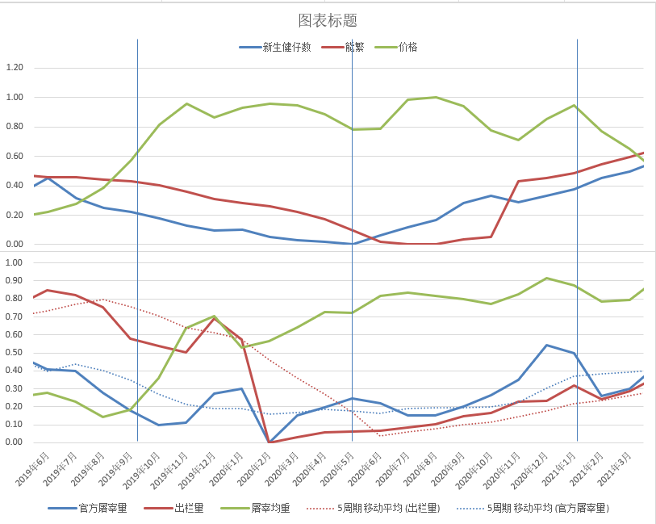
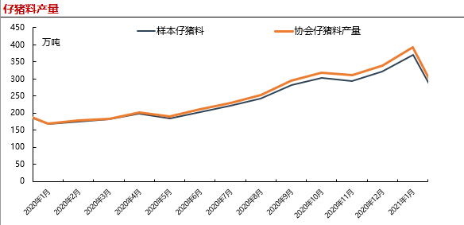
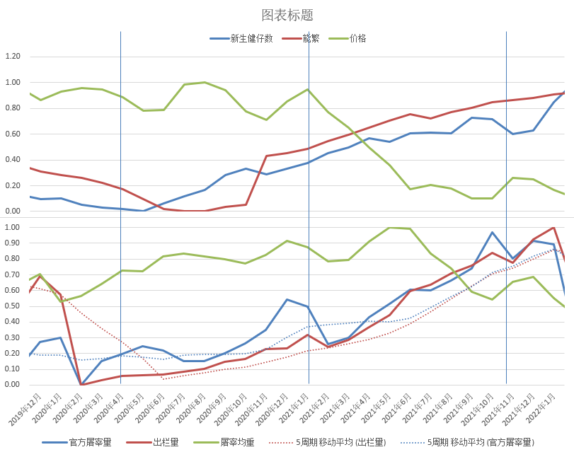

## 供需价格分析

### 分析基础

在以AD-AS模型的基础上来看，供需的平衡点一直在变动，而真实价格一直在向平衡点靠近。

而历史上的价格趋势则说明了平衡点和价格点的关系，而由于生猪的生长周期愿意，价格的变动会有惯性，也就是短期供需结果的价格为了靠近平衡点，供给的调整会大于应有的调整，比如在供小于求的情况下平衡点处于高位，而价格向平衡点靠近时价格体现为上涨，而产业内供给端为了趋利增加供给，但是增加的量大于平衡点的供给量，那么价格就会在达到平衡点后超过平衡点而再次回落，在变动上体现为上涨后的下跌。所以假设为：

- 假设1：平衡点在价格上涨和下跌时出现在价格高点和低点之前。

- 假设2：在没有外力干扰的情况下（AD-AS线不出现波动的情况下）平衡点不动，价格会围绕平衡点波动震荡。

但是生猪行业里的总供给和总需求一直在移动，平衡点也一直在变化，所以需要先确定双线的移动情况去看平衡点的移动情况。短期情绪行为对价格会造成影响，但是不会对平衡点造成影响。而造成双线的移动的原因具体为：

总需求：
1. 短期来看：季节性影响，夏季居民对肉类的进食欲望下降，短期需求下降；冬季相应的上升，且不同季节有不同的节日，节日的来临会右移短期需求线。
2. 长期来看：国民的收入情况、疫情的影响

总供给：
1. 总供给的变动主要是能繁的变动，现代历史（2013年起）每次总供给的大变动是由于各种不同的疫病带来的被动去产能造成的总供给的减少，AS线的左移带来的平衡点上升，随后是价格的上涨。
2. 成本的价格变动也会引起总供给线的变动，成本变高时，高生产成本使销售物品与服务变得不太有利可图，所以成本的提升会造成总供给线的左移。

以此为主框架去分析2018-2022年的猪价数据：
1. 猪价为外三元商品猪
2. 供给端数据为：10月前能繁、6月前新生健仔数
3. 需求端数据为：官方屠宰量（钢联）、出栏量（钢联）以及屠宰均重

自2018年5月份开始，非洲猪瘟来袭，能繁和新生健仔数从2018年5月份开始下降，对应影响时间为2019年3月份开始，这将总供给曲线左移，平衡点上升，对应的价格开始上升。而总供给线的移动一直持续到2020年的6月份，如果总需求线不移动的情况下平衡点在这个时间点之前会一直上移，带来的价格也会一直上移。但是2020年年初中国新冠疫情发生，各个城市地区在2020年间有着大大小小的封城情况，那么在悲观情绪下居民的需求下降，加之餐饮行业的倒闭现象发生，猪肉的需求降低，总需求曲线也会出现左移，总供给带来的平衡点上移在一定程度上被抵消，所以价格在2020年初就没有再出现明显的上涨。那么根据假设1可以判断2020年初到年中猪价的平衡点在33-36元之间。而根据假设2认为价格会围绕这个区间波动。而从2020年6月份开始，10个月前的能繁和6个月前的新生健仔数开始恢复，将总供给线右移，平衡点开始下降，这个现象一直持续到了2022年3月份，中间的长期需求供给并没有并没有什么影响因素，那么这段时间价格应该一直向平衡点靠近，呈现一直下行趋势。但是实际上价格从2021年1月才开始下降，那么判断可能为两种情况：
1. 实际供给并没有这么大幅度的回暖
而验证实际供给的数据采用的是：官方屠宰量，出栏量和屠宰均重。由于过年的原因屠宰和出栏会有明显的下降，为更好的看出来这个阶段的变化，采用移动平均线：

从图中可以看出实际的供给并没有明显有效的回暖，在短期内总供给线的左移并不明显，带来的平衡点下降并不明显，这是价格还处在30块上下的一个原因。

2. 需求在这段时间里有回暖的趋势
在经历了半年的疫情，各个城市开始了有序的疫情调控，需求的下降得到了一定缓解，判断需求线的左移停止了下来。而且在这段时间内还有季节性的需求变化也会影响到短期总需求线，在夏季温度上升，居民饮食偏向于不吃肉类食物，在3-5月份实际供给持平的情况下，需求短期下降，造成平衡点的下移，体现在了价格的下降；而2020年2月份仔猪料的明显下降侧面证明了6月份的实际商品猪并不是和新生健仔数一样呈上升趋势，冬季仔猪受到仔猪腹泻(PED)的影响后移到6月份造成的总供给下降，平衡点上移，所以才有图中价格的轻微下移。

以上两种情况相结合，才体现出了图中产能回升后价格并没有马上下降的情况，原因是实际平衡点的下移幅度还不大，2020年底的上涨则是疫情发生后第一次过年引来的需求短期增长。但是在2020年9、10月份来看，价格就已经开始了下降，正常情况应该是10月份才开始下降，因为国庆的到来会造成短期需求增长，而后节日过去带来的需求恢复，价格的高点提前来到导致的下降也提前了1-2个月。原因是6月份的屠宰均重上升和屠宰量的持平，判断可能是当时有压栏惜售等情绪性行为的存在导致的供给量提前。在2020年末屠宰和出栏有了明显的提升，是因为过年原因，屠宰场将过年时的屠宰量进行了前移和后移，从图中可以看出11-12月份有明显增加，且屠宰均重也有明显增加，这也刺激了价格从11月份开始上涨至1月到达高点。

而从2019年12月到2022年1月期间：
产能在2019年中开始增加，实际供给则是从2020年11月份开始有明显上涨，价格由于过年的原因在2020年11月份呈现上涨趋势。但是整体来看总供给线在这个时间段应该一直在右移，总供给开始了恢复，这也造成了平衡点一直下降的现象，体现为价格开始了下降，并在2022年2月份达到一个低点，13元/公斤，而根据假设1判断平衡点高于13元，并且能繁和新生健仔数恢复到了非瘟前的水平，所以判断平衡点应该在15元左右。

而随着产能的恢复，价格与新生健仔数的相关性变得显著起来，从2021年初到2022年初，屠宰量和出栏量在持续上升，代表着实际的供给在持续的上升，但是价格在2021年中就停止了明显的下降。从宏观分析上来看，总供给线的右移在2022年之前是持续性的右移，带来的平衡点的持续性下降，价格的下降应该也一直持续到2022年之前。从产能上看，新生健仔数在2021年6月份停止了上涨，且从仔猪饲料上看2021年2月份有着明显下降，这说明实际上6、7、8月份的供给有着下降，而屠宰和出栏的上升时因为价格下跌带来的情绪性抛售，并不能说明总供给的量也在同速率上升。总供给在随着新生健仔数在2021年初的停止增长，到3-5月份的一次波动而移动，当然总供给在此期间还在增加，但是增加速率没有这么快了。